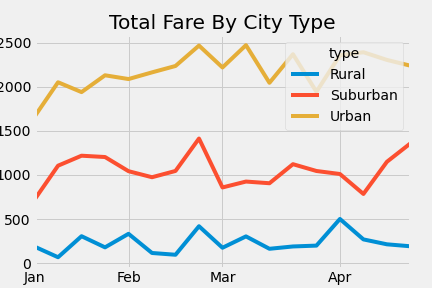

# PyBer with Matplotlib

## Overview of PyBer Analysis

### Purpose

The purpose of this analysis is to visualize the differences in PyBer total fares by type of city and use that information to make business suggestions to increase profit.

## PyBer Analysis Results

### Analysis Results

As can be seen in the above analysis chart, urban cities make more money on fares than surban cities which make more money than rural cities consistently every week.

## PyBer Analysis Summary

To address the disparities among city types, I would suggest encouraging more drivers to sign up in suburban and rural cities. We could promote use of the application by reducing rates in suburban or rural areas. Additionally we could run a marketing campaign to those areas.
